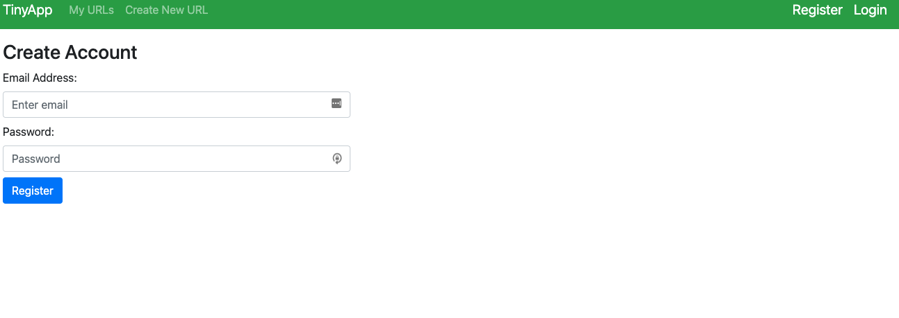
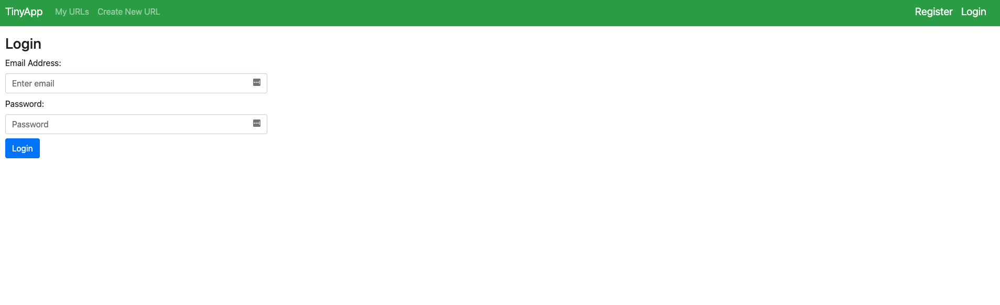
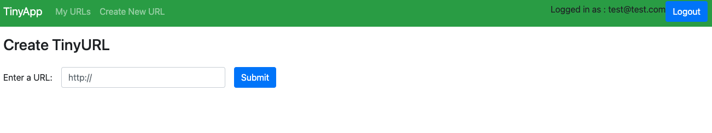
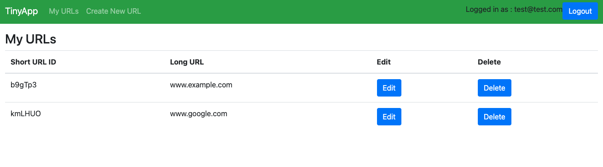
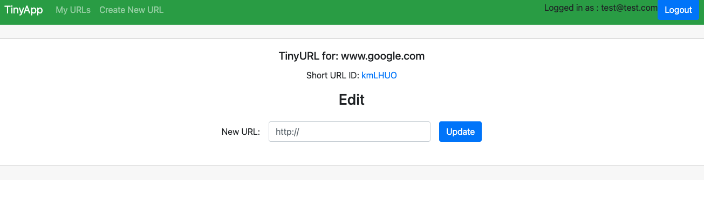

# TinyApp Project

TinyApp is a full stack web application built with Node and Express that allows users to shorten long URLs (à la bit.ly).

## Final Product

Registration Page

Login Page

Create a new tiny url

List of urls under test account

Edit page to edit the urls

## Dependencies

- Node.js
- Express
- EJS
- bcryptjs
- cookie-session

## Getting Started

- Install all dependencies (using the `npm install` command).
- Run the development web server using the `node express_server.js` command.
- Register as a new user and start shortening your long urls.

## How to use the app

- Start your node server 
- Browse to http://localhost:8080/

Enjoy!